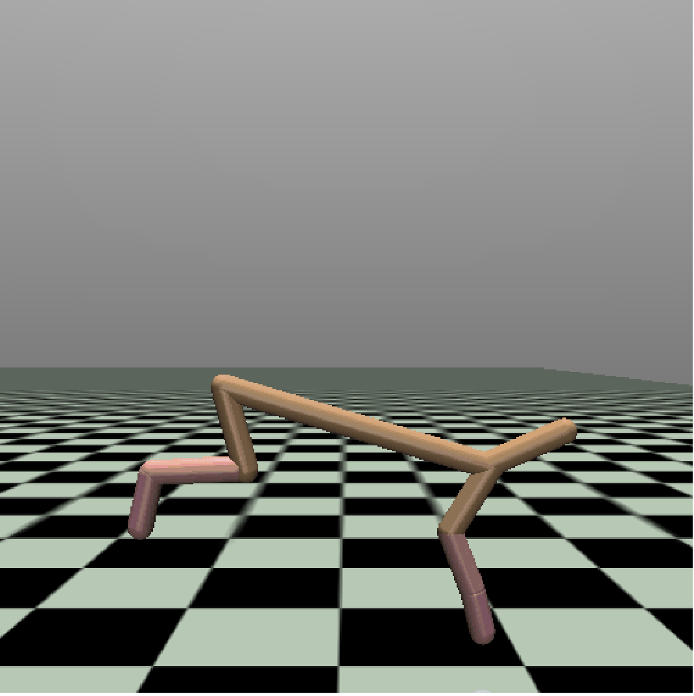
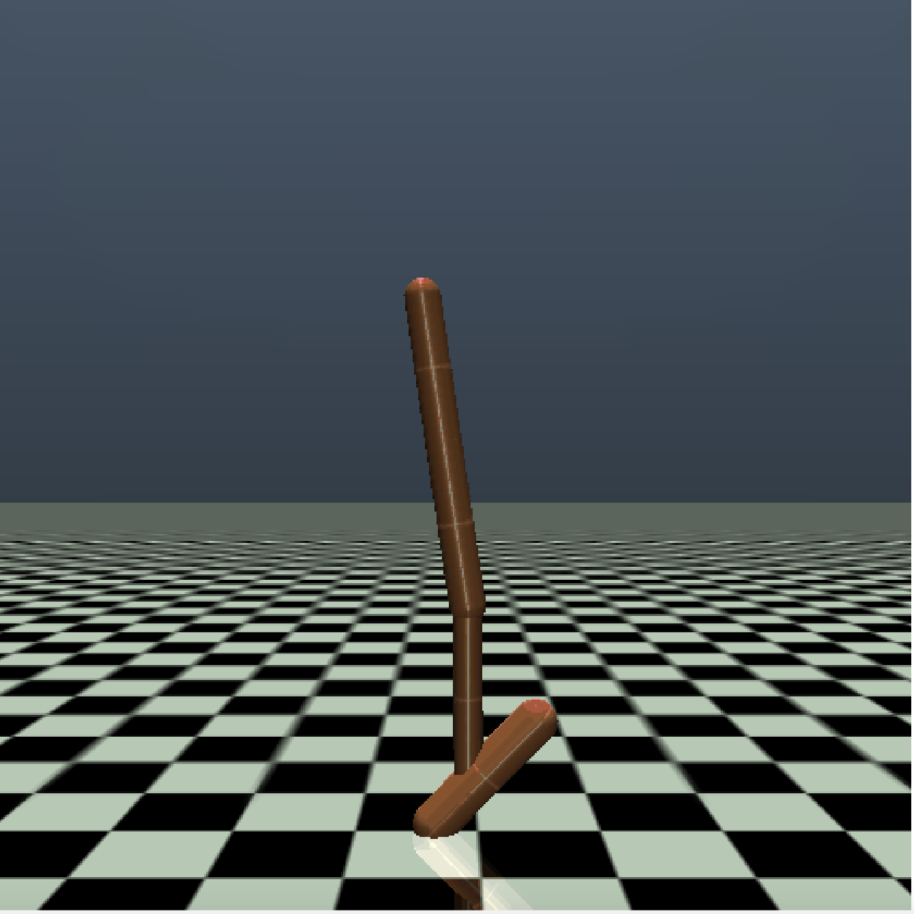

# Offline Policy Comparison with Confidence (opcc)

It's a benchmark comprising **"policy comparison queries"(pcq)** to evaluate uncertainty estimation in offline
reinforcement learning. This work was introduced in the research paper "Offline Policy Comparison with Confidence:
Baseline and Benchmarks".

[](https://github.com/koulanurag/opcc/actions/workflows/python-package.yml)

[](https://codecov.io/gh/koulanurag/opcc)

## Installation

**1. Setup Mujoco**
- Setup **[mujoco 200](https://www.roboti.us/index.html)** [free license can be downloaded from [here](https://www.roboti.us/license.html)]
- Add following to `.bashrc/.zshrc` and source it.  
  ```bash
  export MUJOCO_PY_MUJOCO_PATH=$HOME/.mujoco/mujoco200_linux/bin
  export LD_LIBRARY_PATH=$LD_LIBRARY_PATH:$HOME/.mujoco/mujoco200_linux/bin
  ```
  <br>*(You can also refer **[here](https://github.com/koulanurag/opcc/blob/main/.github/workflows/python-package.yml#L27)** for step-by-step instructions on mujoco installation)*

**2. Setup [Python 3.7+](https://www.python.org/downloads/)** and optionally(recommended) create a  `virtualenv` [(refer here)](https://docs.python.org/3/tutorial/venv.html)

**3. Install Pytorch [\[>= 1.8.0\]](https://pytorch.org/)**

**4. Python package and dependencies could be installed using:**

```bash
python3 -m pip install --upgrade pip setuptools wheel
pip install git+https://github.com/koulanurag/opcc@main#egg=opcc
```

Or

```bash
git clone https://github.com/koulanurag/opcc.git
cd opcc
python3 -m pip install --upgrade pip setuptools wheel
pip install -e .
```

## Testing Package:

- Install : `pip install -e ".[test]"`
- Run: `pytest -v`

## Usage

### Queries:

```python
import opcc
import numpy as np
from sklearn import metrics

env_name = 'HalfCheetah-v2'
dataset_name = 'random'

# ########################################################
# Policy Comparison Queries (PCQ) (Section : 3.1 in paper)
# ########################################################
# Queries are dictionaries with policies as keys and
# corresponding queries as values.
queries = opcc.get_queries(env_name)


def random_predictor(obs_a, obs_b, action_a, action_b,
                     policy_a, policy_b, horizon):
    answer = np.random.randint(low=0, high=2, size=len(obs_a)).tolist()
    confidence = np.random.rand(len(obs_a)).tolist()
    return answer, confidence


targets = []
predictions = []
confidences = []
# Batch iteration through Queries :
for (policy_a_id, policy_b_id), query_batch in queries.items():
    # retrieve policies
    policy_a, _ = opcc.get_policy(*policy_a_id)
    policy_b, _ = opcc.get_policy(*policy_b_id)

    # query-a
    obs_a = query_batch['obs_a']
    action_a = query_batch['action_a']

    # query-b
    obs_b = query_batch['obs_b']
    action_b = query_batch['action_b']

    # horizon for policy evaluation
    horizon = query_batch['horizon']

    # ground truth binary vector:
    # (Q(obs_a, action_a, policy_a, horizon)
    # <  Q(obs_b, action_b, policy_b, horizon))
    target = query_batch['target'].tolist()
    targets += target

    # Let's make predictions for the given queries.
    # One can use any mechanism to predict the corresponding
    # answer to queries, and we simply use a random predictor
    # over here for demonstration purposes
    p, c = random_predictor(obs_a, obs_b, action_a, action_b,
                            policy_a, policy_b, horizon)
    predictions += p
    confidences += c

# #########################################
# Evaluation Metrics (Section 3.3 in paper)
# #########################################
loss = np.logical_xor(predictions, targets)  # we use 0-1 loss for demo
selective_risks_coverage = []
for tau in np.arange(0, 1, 0.1):
    non_abstain_filter = confidences >= tau
    selective_risk = np.sum(loss[non_abstain_filter])
    selective_risk /= np.sum(non_abstain_filter)
    coverage = np.mean(non_abstain_filter)
    selective_risks_coverage.append((selective_risk, coverage))

# AURCC ( Area Under Risk-Coverage Curve): Ideally, we would like it to be 0
selective_risks, coverages = list(zip(*sorted(selective_risks_coverage)))
aurcc = metrics.auc(selective_risks, coverages)

# Reverse-pair-proportion
rpp = np.logical_and(np.expand_dims(loss, 1)
                     < np.expand_dims(loss, 1).transpose(),
                     np.expand_dims(confidences, 1)
                     < np.expand_dims(confidences, 1).transpose()).mean()

# Coverage Resolution (cr_k) : Ideally, we would like it to be 1
k = 10
bins = [_ for _ in np.arange(0, 1 + 1e-5, 1 / k)]
cr_k = np.unique(np.digitize(coverages, bins)).size / len(bins)

print("aurcc: {}, rpp: {}, cr_{}:{}".format(aurcc, rpp, k, cr_k))
```

### Dataset:

```python

# ###########################################
# Datasets: (Section 4 in paper - step (1) )
# ###########################################

import opcc

env_name = 'HalfCheetah-v2'

# list all dataset names corresponding to an env
dataset_names = opcc.get_dataset_names(env_name)

dataset_name = 'random'
# This is a very-slim wrapper over D4RL datasets.
dataset = opcc.get_qlearning_dataset(env_name, dataset_name)

```

### Policy Usage:

```python
import opcc, gym, torch

env_name = "HalfCheetah-v2"
model, model_info = opcc.get_policy(env_name, pre_trained=1)

done = False
env = gym.make(env_name)

obs = env.reset()
while not done:
    action = model.actor(torch.tensor(obs).unsqueeze(0).float())
    obs, reward, done, step_info = env.step(action.data.cpu().numpy()[0])
    env.render()
```

## Benchmark Information

- We borrow dataset's from [**D4RL**](https://arxiv.org/abs/2004.07219)
- Queries can be visualized [**HERE**](https://wandb.ai/koulanurag/cque/reports/Visualization-of-Queries--VmlldzoxMDkxMjcx)
- Baselines can be found here [**HERE**](https://github.com/koulanurag/opcc-baselines)

### :low_brightness: [d4rl:maze2d](https://github.com/rail-berkeley/d4rl/wiki/Tasks#maze2d)


#### Datasets:

|    Environment Name     |      Datasets       |
|:-----------------------:|:-------------------:|
|  `d4rl:maze2d-open-v0`  | `1k, 10k, 100k, 1m` |
| `d4rl:maze2d-medium-v1` | `1k, 10k, 100k, 1m` |
| `d4rl:maze2d-umaze-v1`  | `1k, 10k, 100k, 1m` |
| `d4rl:maze2d-large-v1`  | `1k, 10k, 100k, 1m` |

#### Pre-trained policy performance:

|    Environment Name     | `pre_trained=1` (best) | `pre_trained=2` | `pre_trained=3` | `pre_trained=4` (worst) |
|:-----------------------:|:----------------------:|:---------------:|:---------------:|:-----------------------:|
|  `d4rl:maze2d-open-v0`  |      122.2±10.61       |   104.9±22.19   |   18.05±14.85   |        4.85±8.62        |
| `d4rl:maze2d-medium-v1` |     245.55±272.75      |  203.75±252.61  |  256.65±260.16  |      258.55±262.81      |
| `d4rl:maze2d-umaze-v1`  |      235.5±35.45       |  197.75±58.21   |   23.4±73.24    |        3.2±9.65         |
| `d4rl:maze2d-large-v1`  |     231.35±268.37      |  160.8±201.97   |   50.65±76.94   |        9.95±9.95        |

### :low_brightness: [mujoco(gym)](https://gym.openai.com/envs/#mujoco)

<p float="left">
     
    
    
</p>

#### Datasets:

| Environment Name |                        Datasets                        |
|:----------------:|:------------------------------------------------------:|
| `HalfCheetah-v2` | `random, expert, medium, medium-replay, medium-expert` |
|   `Hopper-v2`    | `random, expert, medium, medium-replay, medium-expert` |
|  `Walker2d-v2`   | `random, expert, medium, medium-replay, medium-expert` |

#### Pre-trained Policy performance:

| Environment Name | `pre_trained=1` (best) | `pre_trained=2` | `pre_trained=3` | `pre_trained=4` (worst) |
|:----------------:|:----------------------:|:---------------:|:---------------:|:-----------------------:|
| `HalfCheetah-v2` |     1169.13±80.45      | 1044.39±112.61  |  785.88±303.59  |       94.79±40.88       |
|   `Hopper-v2`    |     1995.84±794.71     |  1466.71±497.1  | 1832.43±560.86  |       236.51±1.09       |
|  `Walker2d-v2`   |     2506.9±689.45      |  811.28±321.66  |  387.01±42.82   |      162.7±102.14       |
